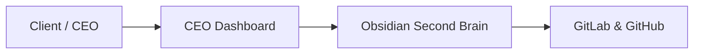

---
tags:
  - styling
  - callouts
  - guide
type: Documentation
---

# 🎨 Pro Callout & Styling Guide for Systemaops Second Brain

Use these rich, SaaS-style callout blocks across your notes to format executive reports, technical warnings, and key takeaways!

---

## 📌 Available Callout Styles

> [!NOTE] Executive Summary
> Use this blue callout block for high-level project summaries and background context.

> [!TIP] Performance Recommendation
> Use this green callout block for efficiency tips, code optimizations, and best practices.

> [!IMPORTANT] Critical Requirement
> Use this cyan callout block for essential business logic, client rules, and deadlines.

> [!WARNING] Potential Risk / Action Needed
> Use this orange callout block to highlight pending blockers, staging warnings, or missing dependencies.

> [!CAUTION] High-Risk Alert
> Use this red callout block for data migration risks or critical system failures.

---

## 💻 Code & Diagram Formatting Example

