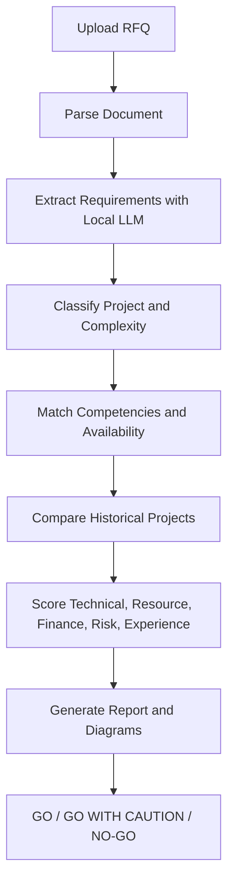

# Architecture

Prepared by: Palak Nagar

## Local Setup Idea

The proposal mentions that the system should run locally and should not depend on external internet services. Because of that, the base structure keeps the AI model, database, uploaded RFQs, and generated reports inside the local setup.

## Main Flow

## Components

- `app`: Streamlit UI for upload, assessment review, and report download.
- `parsers`: code for reading PDF, DOCX, and text files.
- `ai`: code related to Ollama and RFQ requirement extraction.
- `workflows`: LangGraph workflow for the complete RFQ assessment process.
- `repositories`: MongoDB code for employees, skills, availability, projects, and assessment records.
- `scoring`: scoring formulas and final recommendation logic.
- `reports`: feasibility report and diagram generation.

## Planned Database Collections

- `employees`: profile, department, skills, competency levels, availability.
- `historical_projects`: project type, technologies, domain, outcomes, effort, risks.
- `rfq_assessments`: parsed requirements, scores, recommendation, generated report metadata.
- `skill_taxonomy`: skill names, aliases, categories, and proficiency levels.

## Notes

- Keep external API calls disabled unless they are approved.
- Store uploaded RFQs and generated outputs in local folders that are not committed.
- Keep `.env` out of version control.
- Use only dummy or approved sample files in Git.
