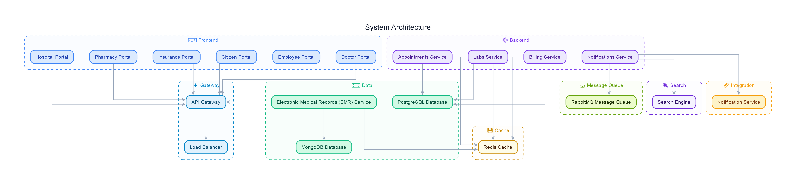

---
tags:
  - rfq-project
  - diagram
  - system-architecture
  - pvms
project: RFQ Viability Management System
type: Diagram Note
---

# 🏗️ System Architecture Diagram Note

## Diagram View

## Description & Scope
Overview of the high-level System Architecture for the RFQ Project Viability Management System (PVMS 2.0).

### Key Architectural Layers:
- **Frontend / UI Layer:** Streamlit Dashboard & Web Interface for RFQ submission and review.
- **Application Core:** Fast API / Python backend handling module orchestrations (Modules 1-4).
- **Data & Storage:** PostgreSQL database, document stores, and report generation outputs.
- **Integration Endpoints:** External APIs and enterprise ERP connections (Odoo, CRM).

---
**Related Notes:**
- [[00 - Project Overview & README]]
- [[architecture]]
- [[PVMS_2_0_IMPLEMENTATION_STATUS]]
