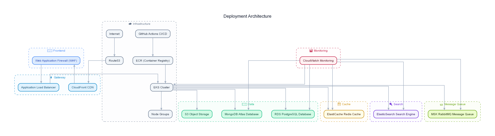

---
tags:
  - rfq-project
  - diagram
  - deployment
  - docker
  - pvms
project: RFQ Viability Management System
type: Diagram Note
---

# 🚀 Deployment Diagram Note

## Diagram View

## Infrastructure Overview
Shows the containerized multi-service deployment layout using Docker and Docker Compose.

### Key Deployment Services:
- **Web Service (`app`):** Python/Streamlit container serving the user interface.
- **Database (`postgres`):** Containerized relational database for structured state and user data.
- **Environment & Network:** Managed via Docker virtual network with environment variable injections (`.env`).

---
**Related Notes:**
- [[local-deployment]]
- [[PVMS_2_0_IMPLEMENTATION_STATUS]]
