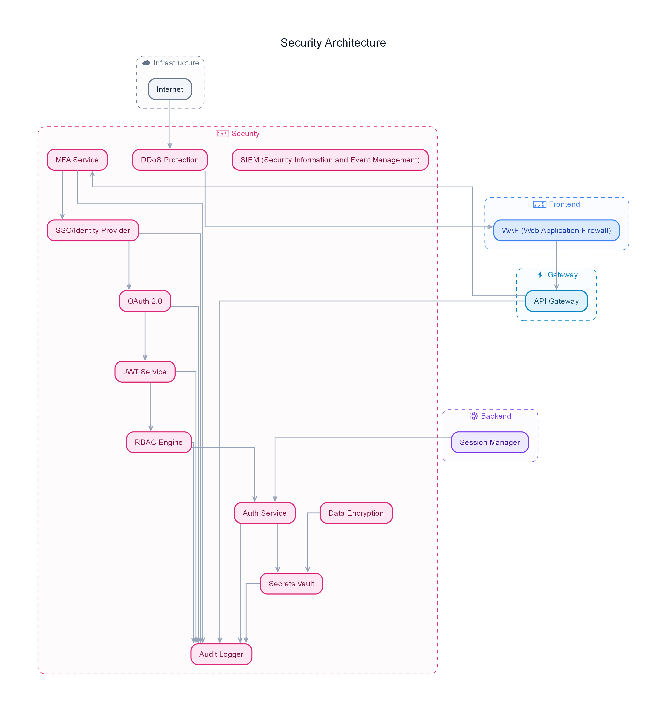

---
tags:
  - rfq-project
  - diagram
  - security
  - pvms
project: RFQ Viability Management System
type: Diagram Note
---

# 🔒 Security Architecture Diagram Note

## Diagram View

## Security Model
Outlines data protection, authentication, and access control mechanisms across the RFQ system.

### Security Layers:
- **Authentication & Authorization:** Token-based access control for API and UI endpoints.
- **Data Protection:** Sanitization of input RFQs, environment credential separation (`.env`), and audit log enforcement.

---
**Related Notes:**
- [[00 - Project Overview & README]]
- [[system_architecture]]
