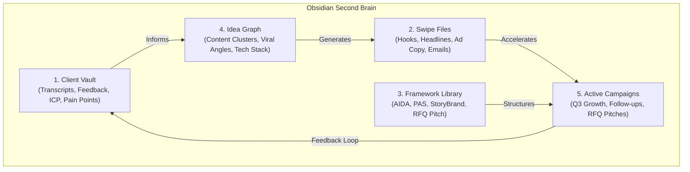

# 🚀 SystemaOps AI-First Marketing Engine & Knowledge Graph

> **Executive Overview:** Based on the AI-First Growth Architect whiteboard framework, this Marketing Hub connects **Client Pain Points & Transcripts**, **Swipe Files**, **Proven Frameworks**, **Idea Knowledge Graph**, and **Growth Campaigns** into our central Obsidian Second Brain.

---

## 🎯 The 5 Core Pillars of the Marketing Engine



---

## 📊 Marketing System Snapshot & Directory

| Pillar | Focus Area | Master Notes & Assets |
| :--- | :--- | :--- |
| 🗣️ **1. Client Vault** | Transcripts, Feedback, ICP, Pain Points | [[05-Marketing/01-Client-Vault/Client Transcripts & Feedback\|Client Vault & Feedback]]<br/>[[05-Marketing/01-Client-Vault/ICP & Buyer Personas\|ICP & Buyer Personas]] |
| 🧲 **2. Swipe Files** | Proven Hooks, Headlines, Email Sequences | [[05-Marketing/02-Swipe-Files/High Converting Hooks & Headlines\|Hooks & Headlines Swipe File]]<br/>[[05-Marketing/02-Swipe-Files/Email Sequences & Sales Pitch Templates\|Email & Pitch Templates]] |
| 📐 **3. Framework Library** | Marketing & Conversion Frameworks | [[05-Marketing/03-Framework-Library/Marketing Frameworks Collection\|Framework Library (AIDA, PAS, StoryBrand)]] |
| 💡 **4. Idea Graph** | Topic Clusters, Content Graph & Angles | [[05-Marketing/04-Idea-Graph/Content Matrix & Topic Clusters\|Idea Knowledge Graph]] |
| 🚀 **5. Active Campaigns** | Growth Campaigns & Automated Sequences | [[05-Marketing/05-Campaigns/2026 Q3 SystemaOps Enterprise Growth Campaign\|Q3 Growth Campaign]] |

---

## 🗣️ Pillar 1: Client Vault (Voice of Customer)
- **Client Transcripts & Feedback:** [[05-Marketing/01-Client-Vault/Client Transcripts & Feedback]]
- **Ideal Customer Profile (ICP) & Persona:** [[05-Marketing/01-Client-Vault/ICP & Buyer Personas]]
- **Key Pain Points:** Unpredictable RFQ scoping timelines, skill-capacity mismatch, manual vendor risk assessment.

---

## 🧲 Pillar 2: Swipe Files & High Converting Copy
- **Hooks & Headlines:** [[05-Marketing/02-Swipe-Files/High Converting Hooks & Headlines]]
- **Email & Sales Pitches:** [[05-Marketing/02-Swipe-Files/Email Sequences & Sales Pitch Templates]]
- **Social & Ad Copy:** Tested messaging formulas for LinkedIn, Twitter/X, and B2B email cold outreach.

---

## 📐 Pillar 3: Framework Library
- **AIDA:** Attention $\rightarrow$ Interest $\rightarrow$ Desire $\rightarrow$ Action
- **PAS:** Problem $\rightarrow$ Agitate $\rightarrow$ Solution
- **StoryBrand:** Character $\rightarrow$ Problem $\rightarrow$ Guide $\rightarrow$ Plan $\rightarrow$ Call to Action $\rightarrow$ Success
- **RFQ Enterprise Pitch:** Technical Feasibility $\rightarrow$ Capacity Match $\rightarrow$ Risk Mitigation Score $\rightarrow$ Commercial Proposal

---

## 💡 Pillar 4: Idea Graph & Content Matrix
- **Topic Clusters:** Enterprise AI Integration, Capacity Planning, Odoo & openDesk Automation, RFQ Viability Engine.
- **Knowledge Graph Links:** Connects client objections to proven swipe files and technical capability documentation.

---

## 🚀 Pillar 5: Growth Campaigns & Follow-Up Sequences
- **Active Campaign:** [[05-Marketing/05-Campaigns/2026 Q3 SystemaOps Enterprise Growth Campaign]]
- **Automated Follow-ups:** 5-touch email nurture sequence for high-value enterprise leads.

---

## 🔄 Dataview: Marketing Assets & Campaign Notes

```dataview
TABLE type AS "Asset Type", tags AS "Tags"
FROM "05-Marketing"
WHERE file.name != "00 - Master Marketing Hub"
SORT file.name ASC
```
