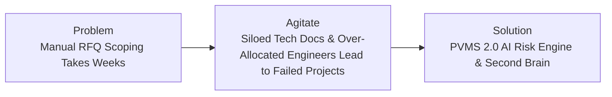

# 📐 Marketing & Conversion Frameworks Collection

> **Pillar 3:** Standardized copywriting, positioning, and messaging frameworks to structure campaigns and proposal pitches.

---

## 1️⃣ PAS Framework (Problem $\rightarrow$ Agitate $\rightarrow$ Solution)

- **Problem:** Scoping RFQs manually consumes weeks of senior engineering bandwidth.
- **Agitate:** Bidding blindly on proposals without checking developer capacity leads to missed deadlines, burned-out teams, and crushed margins.
- **Solution:** PVMS 2.0 automatically syncs Odoo HR employee skills + openDesk XWiki docs to provide instant risk scoring and optimal team matching.

---

## 2️⃣ AIDA Framework (Attention $\rightarrow$ Interest $\rightarrow$ Desire $\rightarrow$ Action)

- **Attention:** *"Cut RFQ evaluation time by 95% using Second Brain AI."*
- **Interest:** *"Connect 60+ Odoo employee profiles and 380+ technical docs into an automated multi-agent risk pipeline."*
- **Desire:** *"Receive 5-dimension risk scores (Technical, Capacity, Financial, Timeline, Governance) and optimal team allocation before signing contracts."*
- **Action:** *"Click to launch your live local PVMS dashboard (`http://localhost:8501`)."*

---

## 3️⃣ StoryBrand Framework (The Customer Hero Journey)

1. **The Hero:** CTOs and CEOs evaluating high-stakes enterprise RFQs.
2. **The Problem:** Fragmented data across Odoo, openDesk XWiki, and local files makes accurate scoping impossible.
3. **The Guide:** SystemaOps AI Second Brain Engine.
4. **The Plan:**
   - Step 1: Sync Odoo HR & openDesk XWiki data.
   - Step 2: Upload RFQ document to PVMS 2.0.
   - Step 3: View automated GO / NO-GO recommendations on CEO Dashboard.
5. **Call to Action:** Implement automated Second Brain integration.
6. **Result in Success:** 100% capacity matching accuracy, 0 skill gaps, 95% faster execution.

---

## 🔄 Related Knowledge Links
- [[05-Marketing/01-Client-Vault/ICP & Buyer Personas|ICP & Buyer Personas]]
- [[05-Marketing/02-Swipe-Files/High Converting Hooks & Headlines|Hooks & Headlines Swipe File]]
- [[05-Marketing/04-Idea-Graph/Content Matrix & Topic Clusters|Idea Knowledge Graph]]
