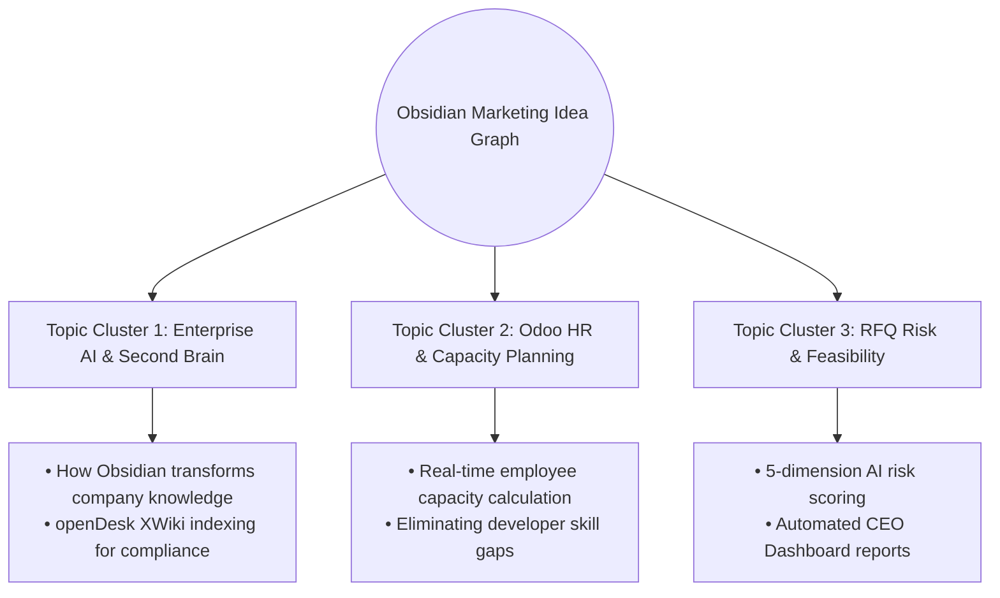

# 💡 Marketing Idea Knowledge Graph & Content Matrix

> **Pillar 4:** Interconnected web of marketing angles, technical capabilities, content ideas, and growth channels.

---

## 🕸️ Knowledge Graph Architecture

---

## 📚 Content Topic Matrix

| Content Pillar | Sub-Topic | Primary Channel | Target Asset |
| :--- | :--- | :--- | :--- |
| **Enterprise Second Brain** | "Why Every Software Company Needs an Obsidian Second Brain" | LinkedIn / Blog | Case Study Note |
| **Odoo Capacity Sync** | "Stop Scoping Projects Blind: Real-time Odoo Task Utilization" | B2B Email Cold Pitch | [[05-Marketing/02-Swipe-Files/Email Sequences & Sales Pitch Templates\|Email Templates]] |
| **RFQ Viability** | "The 5-Dimension AI Risk Score for RFQs" | Executive Briefing PDF | [[04-Projects/rfq-knowledge/00 - RFQ Project Knowledge Base Index\|RFQ Hub]] |
| **OpenDesk Integration** | "Indexing 380+ Wiki Pages for Instant Tech Stack Checks" | Technical Whitepaper | [[05-Marketing/03-Framework-Library/Marketing Frameworks Collection\|Framework Library]] |

---

## 🔄 Related Knowledge Links
- [[05-Marketing/00 - Master Marketing Hub|Master Marketing Hub]]
- [[05-Marketing/02-Swipe-Files/High Converting Hooks & Headlines|Hooks & Headlines Swipe File]]
- [[05-Marketing/05-Campaigns/2026 Q3 SystemaOps Enterprise Growth Campaign|Q3 Growth Campaign]]
