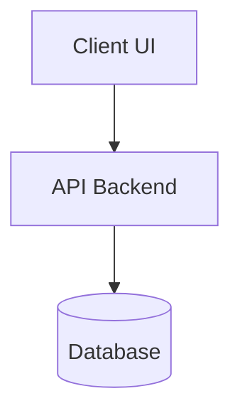

---
tags:
  - architecture
  - spec
  - technical
date: {{date}}
author: ""
type: Architecture Spec
---

# 🏗️ Technical Specification: {{title}}

## 📋 System Overview
- **System / Component Name:** {{title}}
- **Author:** 
- **Status:** Draft / Review / Approved
- **Date:** {{date}}

---

## 🎯 Architectural Goals & Requirements
1. 
2. 

---

## 📐 System Diagram & Components


---

## 🔌 API Contracts & Interfaces
- **Endpoint:** `POST /api/v1/...`
- **Payload:**
```json
{
  "status": "success"
}
```

---

## 🔒 Security & Performance Considerations
- 

---
*Systemaops Technical Architecture Template*
