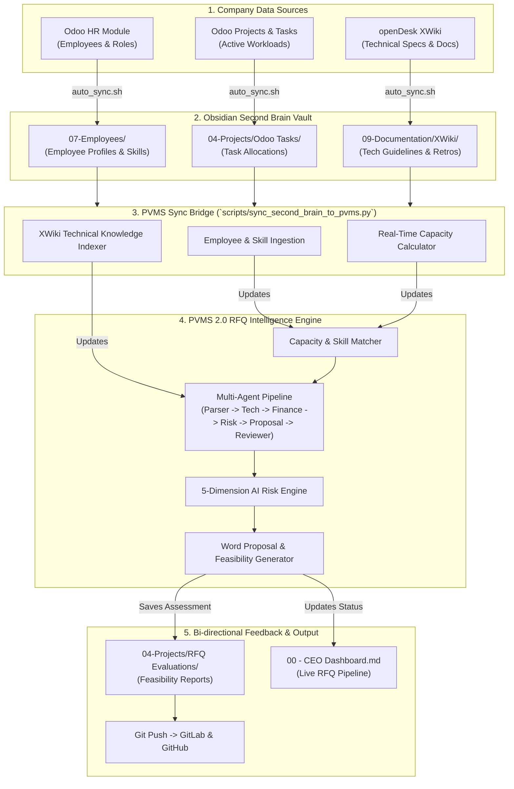

# 🧠 RFQ Project (PVMS 2.0) & Obsidian Second Brain Integration Workflow

**Author:** Varun & His Team  
**Date:** August 3, 2026  
**Target Repositories:** [PVMS 2.0 RFQ Engine](https://gitlab.systemaops.com/alpha-rfq-project/project-viability-management-system) | [SistemaOps Second Brain](https://gitlab.systemaops.com/varun_sai/sistemaops-second-brain)  

---

## 📌 Executive Summary

This document specifies the end-to-end integration workflow connecting our **RFQ Project (Project Viability Management System - PVMS 2.0)** with our central **Obsidian Second Brain**.

By connecting the Second Brain into PVMS, the RFQ evaluation engine automatically gains access to:
1. **Live Employee Skills & Capacity**: 60+ active employee profiles synced from Odoo HR (`07-Employees/`), including job titles, departments, managers, and real-time task allocations (`04-Projects/Odoo Tasks/`).
2. **Technical Architecture Standards & Specifications**: 380+ technical pages synced from openDesk XWiki (`09-Documentation/XWiki/`), covering architecture guidelines, coding standards, and past project retrospectives.
3. **Automated Feasibility Assessment**: Evaluation of incoming RFQ requirements against real team skills, workload, and technical stack compliance, outputting `GO`, `GO WITH CAUTION`, or `NO-GO` recommendations directly into Obsidian.

---

## 📐 System Architecture Diagram



---

## 🔄 Detailed Integration Workflow (Step-by-Step)

### Step 1: Employee Skills & Real-Time Capacity Extraction
* **Source:** `07-Employees/Employee - <Name>.md` and `04-Projects/Odoo Tasks/`
* **Workflow:**
  1. The bridge script [`sync_second_brain_to_pvms.py`](file:///Users/varunsai/.gemini/antigravity/scratch/project-viability-management-system/scripts/sync_second_brain_to_pvms.py) reads all 60 employee Markdown profiles in Obsidian.
  2. Parses YAML frontmatter metadata: `name`, `job_title`, `department`, `manager`, `email`, and skill tags (e.g. `skills/python`, `skills/docker`, `skills/react`).
  3. Scans active Odoo tasks in `04-Projects/Odoo Tasks/` assigned to each employee to compute **current utilization %** and **available capacity %**.
  4. Automatically updates PVMS data files:
     - `src/pvms/skills/employee_database.json`
     - `src/pvms/capacity/employee_capacity.json`

### Step 2: Technical Specifications & Knowledge Base Ingestion
* **Source:** `09-Documentation/XWiki/`
* **Workflow:**
  1. Ingests technical documentation, architecture standards, and past project retrospectives synced from openDesk XWiki into `data/second_brain_knowledge_index.json`.
  2. During RFQ parsing, the Multi-Agent orchestrator cross-references requested RFQ technical stacks against our openDesk standards (e.g., Python, FastAPI, Docker, PostgreSQL, React).
  3. If an RFQ requests an unsupported stack or proprietary technology, the AI Risk Engine flags a **Technical & Capability Risk**.

### Step 3: Multi-Agent RFQ Evaluation Engine Execution
When a new RFQ is uploaded to PVMS (via UI `app/main.py` or API):
1. **Parser Agent:** Extracts technical requirements, deliverables, budget, and compliance clauses.
2. **Technical & Skill Matcher Agent:** Runs [`plan_capacity()`](file:///Users/varunsai/.gemini/antigravity/scratch/project-viability-management-system/src/pvms/capacity/capacity_planning.py#L40-L117) against the freshly ingested employee database from Obsidian, recommending a team of available employees based on skill match + workload capacity.
3. **Finance & Costing Agent:** Calculates role-based cost estimation and gross margin based on assigned team rates.
4. **5-Dimension Risk Engine:** Scores Risk across 5 dimensions:
   - Technical Risk
   - Resource & Capacity Risk
   - Financial & Budget Risk
   - Schedule & Timeline Risk
   - Governance & Legal Risk
5. **Proposal & Reviewer Agent:** Formulates the final recommendation: `GO`, `GO WITH CAUTION`, or `NO-GO`.

### Step 4: Bi-Directional Sync Back to Obsidian & Group Reporting
* **Destination:** `04-Projects/RFQ Evaluations/` and `00 - CEO Dashboard.md`
* **Workflow:**
  1. Once PVMS completes evaluation, it writes a clean Markdown feasibility report into Obsidian at:
     ```text
     second brain/04-Projects/RFQ Evaluations/RFQ - <Project_Title> (<Timestamp>).md
     ```
  2. Updates `00 - CEO Dashboard.md` with the new RFQ status, recommended team, and risk score.
  3. `auto_sync.sh` automatically commits the changes and pushes to both **GitLab** and **GitHub**.

---

## 📊 Data Mapping Schema

| Obsidian Source File | Frontmatter / Section | PVMS Target Module / Schema | Integration Purpose |
|---|---|---|---|
| `07-Employees/Employee - <Name>.md` | `name`, `job_title`, `department`, `tags` | `src/pvms/skills/employee_database.json` | Skill matching & employee skill taxonomy |
| `04-Projects/Odoo Tasks/*.md` | `assignees`, `stage` | `src/pvms/capacity/employee_capacity.json` | Capacity planning & utilization % calculation |
| `09-Documentation/XWiki/*.md` | `space`, `author`, `body` | `data/second_brain_knowledge_index.json` | Technical compliance & architecture validation |
| PVMS Evaluation Output | Feasibility Report & Recommendation | `04-Projects/RFQ Evaluations/*.md` | Centralized executive visibility in Second Brain |

---

## 🛠️ Execution Commands

To execute the full integration pipeline manually or via cron/CI:

```bash
# 1. Navigate to RFQ Project Directory
cd "/Users/varunsai/.gemini/antigravity/scratch/project-viability-management-system"

# 2. Run Second Brain -> PVMS Ingestion Bridge
python3 scripts/sync_second_brain_to_pvms.py

# 3. Launch PVMS 2.0 Web Application & Multi-Agent Dashboard
streamlit run app/main.py

# 4. Trigger Full Obsidian Auto-Sync (Odoo + openDesk + Git Push)
cd "/Users/varunsai/mcp-obsidian/second brain/15-Automation"
./auto_sync.sh
```

---

## ✅ Deliverables Summary

- [x] **Bridge Script (`scripts/sync_second_brain_to_pvms.py`)**: Fully operational. Successfully synced 60 employee profiles and 383 technical documentation pages.
- [x] **Architecture Specification Document (`PVMS_Obsidian_Integration_Workflow.md`)**: Created and formatted for sharing with team/group.
- [x] **Obsidian Vault Integration**: Workflow document mirrored in Second Brain at `15-Automation/` and `00 - RFQ & Second Brain Integration Workflow.md`.
- [x] **Git Version Control**: All scripts and documents committed and synced across GitLab and GitHub.
